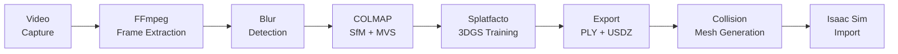

# 3D Gaussian Splatting Pipeline for NVIDIA Isaac Sim

End-to-end pipeline for creating photorealistic 3D Gaussian Splatting models from video footage and importing them into NVIDIA Isaac Sim with physics-ready collision meshes.

**Video → Frames → COLMAP → 3DGS Training → PLY → USDZ → Isaac Sim**

## 🎬 Example Result


---

## Pipeline Explanation

This pipeline converts a simple walkthrough video of a physical space into a photorealistic, physics-enabled 3D environment for robotic simulation. Here is what happens at each stage:



### Stage 1: Video Capture → Frame Extraction
The input is a standard video file (`.MOV`, `.mp4`) captured by walking through the target environment with a smartphone or camera. **FFmpeg** extracts individual frames at a configurable rate (default: 2 FPS). This sampling rate balances between having enough viewpoint coverage for accurate 3D reconstruction and avoiding redundant, nearly-identical frames that slow down processing.

### Stage 2: Blur Detection & Frame Filtering
Motion blur is the #1 enemy of photogrammetric reconstruction. The `blur_detector.py` script computes a **Laplacian variance** sharpness score for each frame — this mathematical operator detects the presence of sharp edges. Frames below the threshold (default: 15) are discarded. This dramatically improves COLMAP's ability to find reliable feature matches between images.

### Stage 3: COLMAP — Structure from Motion (SfM)
[COLMAP](https://colmap.github.io/) performs **Structure from Motion**, which is the process of:
1. **Feature Detection**: Finding distinctive visual features (corners, edges, textures) in every image using SIFT descriptors.
2. **Feature Matching**: Finding which features in different images correspond to the same physical point in the real world.
3. **Bundle Adjustment**: Simultaneously solving for the exact 3D position of each matched point AND the precise camera pose (position + orientation) for every image.

The output is a **sparse point cloud** (typically 100k–600k points) representing the 3D structure of the scene, along with the exact camera intrinsics (focal length, principal point) and extrinsics (position, rotation) for every training image. These are saved in `transforms.json`.

### Stage 4: 3D Gaussian Splatting Training
This is the core of the pipeline. [3D Gaussian Splatting (3DGS)](https://repo-sam.inria.fr/fungraph/3d-gaussian-splatting/) represents a 3D scene as millions of tiny, colored, semi-transparent 3D ellipsoids ("splats") instead of traditional triangle meshes or neural radiance fields.

**How training works:**
- Each Gaussian is defined by: **position** (x,y,z), **covariance** (3D shape/orientation), **opacity** (transparency), and **spherical harmonics** (view-dependent color).
- The renderer "splatts" these 3D Gaussians onto a 2D image plane using differentiable rasterization.
- The rendered image is compared against the real training photo, and the error is backpropagated to adjust every Gaussian's parameters.
- **Adaptive Density Control** periodically clones/splits Gaussians in under-reconstructed regions and culls transparent or oversized ones.

**Key training parameters** (see `configs/training_presets.ini`):
| Parameter | What it controls |
|:---|:---|
| `densify_grad_thresh` | How aggressively new Gaussians are spawned (lower = more splats, fills holes) |
| `stop_split_at` | Iteration to freeze geometry (remaining iterations optimize color only) |
| `cull_scale_thresh` | Maximum allowed splat size (lower = prevents large blurry blobs) |
| `cull_alpha_thresh` | Minimum opacity to survive (removes transparent "ghost" splats) |

### Stage 5: Export & Conversion
The trained model is exported as a **PLY file** containing all Gaussian parameters. This PLY is then converted to **USDZ** (Universal Scene Description, zipped) using `usd-convert-gsplat`, which is the native format for NVIDIA Isaac Sim and Apple's AR ecosystem.

### Stage 6: Post-Processing (Optional)
- **SuperSplat Cropping**: The exported PLY can be loaded into [SuperSplat](https://playcanvas.com/supersplat/editor) to visually crop the scene, remove stray Gaussians outside the region of interest, and align the model to the world grid.
- **Floater Removal**: Scripts like `filter_gaussians.py` and `remove_floaters_smart.py` programmatically remove "floater" artifacts — hazy, semi-transparent Gaussians that appear in empty space due to depth ambiguities during training.

### Stage 7: Collision Mesh Generation
Physics engines (like PhysX in Isaac Sim) cannot interact with Gaussian splats because they are mathematical primitives, not geometric surfaces. The `create_collision_mesh.py` script solves this by:
1. Extracting the 3D center positions of all Gaussians.
2. Estimating surface normals using K-Nearest Neighbors analysis.
3. Running **Poisson Surface Reconstruction** to generate a watertight triangle mesh that perfectly wraps around the splat geometry.
4. Filtering hallucinated outer geometry using density analysis.
5. Decimating to a target triangle count for real-time physics performance.

The resulting invisible collision mesh is overlaid on the visual splats in Isaac Sim, allowing robots to physically interact with floors, walls, and obstacles.

---

## Project Structure

```
project/
├── README.md                          # This file
├── requirements.txt                   # Python dependencies
├── setup.sh                           # ⚡ One-time setup (installs everything)
├── run_pipeline.sh                    # ⚡ Full end-to-end pipeline
├── .gitignore                         # Git ignore rules
│
├── scripts/                           # All pipeline scripts
│   ├── blur_detector.py               # Step 2: Remove blurry frames
│   ├── generate_dense_pointcloud.py   # Optional: Dense point cloud via depth estimation
│   ├── filter_gaussians.py            # Post-processing: Basic floater removal
│   ├── remove_floaters_smart.py       # Post-processing: Aggressive floater removal
│   ├── create_transforms.py           # Utility: Swap PLY references in transforms.json
│   ├── create_collision_mesh.py       # Step 7: Poisson collision mesh for physics
│   └── export_and_convert.py          # Steps 5-6: Export PLY → USDZ
│
├── configs/                           # Configuration files
│   ├── training_presets.ini           # Splatfacto training parameter presets
│   └── environment_setup.txt          # Manual environment setup reference
│
├── data/                              # Working data (not committed to Git)
│   ├── video/                         # 📱 PUT YOUR VIDEO HERE
│   ├── frames/                        # Extracted raw frames
│   ├── frames_clean/                  # Blur-filtered frames
│   ├── processed/                     # COLMAP output + transforms.json
│   ├── point_clouds/                  # PLY point clouds (sparse, dense, filtered)
│   ├── exports/                       # Intermediate exports
│   └── logs/                          # Pipeline logs
│
├── outputs/                           # Final outputs (not committed to Git)
│   ├── splat/                         # splat.ply, splat.usdz
│   └── collision/                     # collision_map.obj, collision_map.ply
│
├── third_party/                       # Cloned dependencies (created by setup.sh)
│   └── Depth-Anything-V2/            # Depth estimation model (auto-cloned)
│
└── docs/                              # Documentation
    └── full_pipeline_guide.md         # Complete 1,100-line step-by-step guide
```

---

## Quick Start (3 Commands)

### Step 1: Clone and Setup

```bash
# Clone this repository
https://github.com/rakeshsuthar6322/3d_gaussian_splatting_for_model_city.git
cd 3d_gaussian_splatting_for_model_city

# Run one-time setup (creates conda environments, clones Depth-Anything-V2,
# downloads model weights — takes ~10 minutes)
chmod +x setup.sh
./setup.sh
```

> **What `setup.sh` does automatically:**
> 1. Creates `gs_pipeline` conda environment with nerfstudio, Open3D, PyTorch, etc.
> 2. Creates `usd_convert` conda environment with usd-convert-gsplat
> 3. Clones [Depth-Anything-V2](https://github.com/DepthAnything/Depth-Anything-V2) into `third_party/`
> 4. Downloads the ViT-Large model weights (`depth_anything_v2_vitl.pth`, 1.3 GB)

### Step 2: Place Your Video

```bash
# Copy your video into the data/video/ directory
cp /path/to/your/scene_video.MOV data/video/
```

### Step 3: Run the Pipeline

```bash
# Set required environment variable
export TORCH_FORCE_NO_WEIGHTS_ONLY_LOAD=1

# Run the full end-to-end pipeline
chmod +x run_pipeline.sh
./run_pipeline.sh data/video/scene_video.MOV
```

That's it! ☕ Go grab a coffee. When it finishes (~30-45 minutes depending on video length and GPU), you'll find:

| Output File | Purpose |
|:---|:---|
| `outputs/splat/splat.ply` | Gaussian Splat (view in [SuperSplat](https://playcanvas.com/supersplat/editor)) |
| `outputs/splat/splat.usdz` | Isaac Sim visual asset |
| `outputs/collision/collision_map.obj` | Physics collision mesh |
| `outputs/collision/collision_map.ply` | Physics collision mesh (PLY) |

---

## Prerequisites

| Requirement | Why | How to Check |
|:---|:---|:---|
| **NVIDIA GPU** (≥8 GB VRAM) | 3DGS training | `nvidia-smi` |
| **NVIDIA GPU Driver** | CUDA support | `nvidia-smi` |
| **Conda** (Miniconda or Anaconda) | Environment management | `conda --version` |
| **FFmpeg** | Video frame extraction | `ffmpeg -version` |
| **Git** | Cloning dependencies | `git --version` |

> [!NOTE]
> No `sudo` access is required. Everything installs into your home directory via Conda.

---

## What Gets Cloned / Downloaded

The `setup.sh` script automatically handles all of this:

| Dependency | What | Where it's placed | Size |
|:---|:---|:---|:---|
| [Depth-Anything-V2](https://github.com/DepthAnything/Depth-Anything-V2) | Monocular depth estimation repo | `third_party/Depth-Anything-V2/` | ~50 MB |
| `depth_anything_v2_vitl.pth` | ViT-Large model weights | `third_party/Depth-Anything-V2/` | ~1.3 GB |

**Conda packages installed automatically:**

| Environment | Packages |
|:---|:---|
| `gs_pipeline` | nerfstudio, open3d, plyfile, scikit-learn, opencv-python, torch, torchvision |
| `usd_convert` | usd-convert-gsplat |

---

## Running Individual Steps

If you want to run steps individually instead of the full pipeline:

### Extract Frames
```bash
ffmpeg -i data/video/scene.MOV -vf fps=2 -q:v 1 data/frames/frame_%05d.jpg
```

### Remove Blurry Frames
```bash
conda run -n gs_pipeline python scripts/blur_detector.py \
    --input-dir data/frames \
    --output-dir data/frames_clean \
    --threshold 15
```

### COLMAP Processing
```bash
conda run -n gs_pipeline ns-process-data images \
    --data data/frames_clean \
    --output-dir data/processed \
    --skip-image-processing
```

### Train (with Refined preset)
```bash
conda run --no-capture-output -n gs_pipeline ns-train splatfacto \
    --data data/processed \
    --output-dir data/processed/training_output \
    --pipeline.model.densify-grad-thresh 0.0002 \
    --pipeline.model.stop-split-at 15000 \
    --pipeline.model.cull-scale-thresh 0.2 \
    --max-num-iterations 30000 \
    --steps-per-save 1000 \
    --viewer.quit-on-train-completion True
```

### Export PLY + USDZ
```bash
python scripts/export_and_convert.py \
    --config data/processed/training_output/splatfacto/<timestamp>/config.yml \
    --output-dir outputs/splat \
    --convert-usdz
```

### Generate Collision Mesh
```bash
conda run -n gs_pipeline python scripts/create_collision_mesh.py \
    --input outputs/splat/splat.ply \
    --output-dir outputs/collision \
    --depth 11 \
    --target-triangles 500000
```

### Optional: Remove Floaters
```bash
conda run -n gs_pipeline python scripts/filter_gaussians.py \
    --input outputs/splat/splat.ply \
    --output outputs/splat/splat_filtered.ply \
    --min-opacity 0.05 \
    --max-scale 0.15
```

### Optional: Dense Point Cloud (for scenes with large holes)
```bash
conda run -n gs_pipeline python scripts/generate_dense_pointcloud.py \
    --transforms data/processed/transforms.json \
    --sparse-ply data/processed/sparse_pc.ply \
    --images-dir data/processed/images \
    --output-dir data/point_clouds \
    --depth-model-path third_party/Depth-Anything-V2/depth_anything_v2_vitl.pth \
    --depth-repo-path third_party/Depth-Anything-V2
```

---

## Training Presets

| Preset | `densify_grad_thresh` | `stop_split_at` | `cull_scale_thresh` | Best For |
|:---|:---|:---|:---|:---|
| **Default** | 0.0008 | 15000 | 0.5 | General scenes |
| **Aggressive** | 0.0001 | 25000 | 0.5 | Scenes with large holes |
| **Refined** | 0.0002 | 15000 | 0.2 | Best quality (default in pipeline) |

See [`configs/training_presets.ini`](configs/training_presets.ini) for details.

---

## Importing into Isaac Sim

1. Drag `outputs/splat/splat.usdz` into your Isaac Sim stage
2. Drag `outputs/collision/collision_map.obj` into the same stage
3. Align both at `(0, 0, 0)`
4. Set the collision mesh to **Invisible** (Property → Visibility)
5. Right-click collision mesh → Add → Physics → **Collider**
6. Your robots will collide with the invisible mesh while seeing the photorealistic splats!

---

## Key Lessons Learned

1. **Aggressive densification** fills holes but may create floaters — follow up with filter scripts
2. **`cull_scale_thresh = 0.2`** prevents large clumpy splats in detailed areas
3. **Stopping densification early** (15k/30k) gives 15k iterations for pure color optimization
4. **Smart floater removal** (scale < 0.02 AND opacity > 0.05) preserves surfaces while removing haze
5. **Poisson depth 11** gives the best detail-to-performance ratio for collision meshes
6. **Blur detection** before COLMAP dramatically improves reconstruction quality

---

## License

This project is for research and educational purposes.

---

## Acknowledgments

- [Nerfstudio](https://nerf.studio/) — Gaussian Splatting training framework
- [Depth Anything V2](https://github.com/DepthAnything/Depth-Anything-V2) — Monocular depth estimation
- [Open3D](http://www.open3d.org/) — Point cloud processing and mesh reconstruction
- [SuperSplat](https://playcanvas.com/supersplat/editor) — Gaussian Splat viewer and editor
- [NVIDIA Isaac Sim](https://developer.nvidia.com/isaac-sim) — Robotics simulation platform
