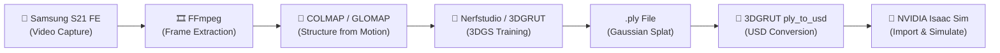

# 📸 → 🧊 Complete Guide: Gaussian Splatting for Isaac Sim with Samsung S21 FE

> **OS: Ubuntu 22.04 LTS (NO sudo access)** | Every tool installed in user-space via Conda/pip/portable binaries
>
> End-to-end pipeline: **Video Capture → Frame Extraction → 3D Gaussian Splatting → USD → Isaac Sim**

---

## Pipeline Overview



---

## Part 0: Ubuntu 22.04 System Prerequisites (NO sudo Required)

> [!IMPORTANT]
> **The ONLY thing that requires sudo is the NVIDIA GPU driver.** If `nvidia-smi` works on your machine, the driver is already installed by your system admin. Everything else below installs into your `$HOME` directory with zero root privileges.

### 0.1 — Verify GPU Driver (Must Be Pre-Installed)

```bash
# Check that the NVIDIA driver is already installed
nvidia-smi
```

You should see output showing your GPU and CUDA version. If this command fails, you need to ask your system administrator to install the NVIDIA driver — this is the **one and only** step that requires root access.

### 0.2 — Install Miniconda (User-Space Python + Package Manager)

Miniconda is your lifeline without sudo. It can install not just Python packages but also **system-level binaries** (gcc, cmake, ffmpeg, COLMAP, etc.) all inside `~/miniconda3/`.

```bash
# Download Miniconda
wget https://repo.anaconda.com/miniconda/Miniconda3-latest-Linux-x86_64.sh

# Install to your home directory (no sudo needed)
bash Miniconda3-latest-Linux-x86_64.sh -b -p $HOME/miniconda3

# Initialize conda for your shell
$HOME/miniconda3/bin/conda init bash
source ~/.bashrc

# Verify
conda --version

# Clean up installer
rm Miniconda3-latest-Linux-x86_64.sh
```

**Why Conda is essential without sudo:**
Normally you'd use `sudo apt install cmake gcc ffmpeg colmap`. Without sudo, Conda replaces `apt` entirely — it installs pre-compiled binaries of these tools into your home directory, completely isolated from the system.

### 0.3 — Create the Master Environment with All Build Tools

```bash
# Create a single environment with all the build tools you need
conda create --name gs_pipeline -y python=3.10

conda activate gs_pipeline

# Install build tools (replaces sudo apt install build-essential cmake ninja-build)
conda install -y -c conda-forge \
    gcc_linux-64 \
    gxx_linux-64 \
    cmake \
    ninja \
    make \
    pkg-config \
    git \
    wget \
    curl \
    unzip
```

**What each package replaces:**

| Conda Package | Replaces `sudo apt install ...` | Purpose |
|:---|:---|:---|
| `gcc_linux-64` | `build-essential` (gcc) | C compiler — compiles CUDA extensions, COLMAP |
| `gxx_linux-64` | `build-essential` (g++) | C++ compiler — same |
| `cmake` | `cmake` | Build system generator — used by COLMAP, Open3D |
| `ninja` | `ninja-build` | Fast build tool — speeds up compilation |
| `make` | `make` | Traditional build tool (fallback) |
| `pkg-config` | `pkg-config` | Finds library paths during compilation |
| `git` | `git` | Version control — cloning repositories |

### 0.4 — Install CUDA Toolkit (User-Space, No sudo)

```bash
conda activate gs_pipeline

# Install CUDA toolkit via conda (installs into ~/miniconda3/envs/gs_pipeline/)
conda install -y -c nvidia cuda-toolkit=12.1

# Verify CUDA compiler is available
nvcc --version
# Should show: Cuda compilation tools, release 12.1
```

**Why this works:** The conda CUDA toolkit installs `nvcc`, CUDA libraries, and headers entirely inside your conda environment. It does NOT touch `/usr/local/cuda/` or require root. As long as the NVIDIA **driver** is installed system-wide (by your admin), this user-space CUDA toolkit can compile and run GPU code.

### 0.5 — Install FFmpeg (User-Space)

```bash
conda activate gs_pipeline

# Install FFmpeg via conda (replaces sudo apt install ffmpeg)
conda install -y -c conda-forge ffmpeg

# Verify
ffmpeg -version
```

### 0.6 — Install COLMAP (User-Space)

#### Method A: Conda (Easiest — CPU-only)

```bash
conda activate gs_pipeline

conda install -y -c conda-forge colmap

# Verify
colmap -h
```

> [!NOTE]
> The conda-forge COLMAP build may be **CPU-only** (no GPU acceleration). This is slower but works. For GPU-accelerated COLMAP, use Method B.

#### Method B: Build from Source (GPU-Accelerated, No sudo)

This is more work but gives you the fastest COLMAP with GPU support:

```bash
conda activate gs_pipeline

# Install COLMAP's dependencies via conda (no sudo needed)
conda install -y -c conda-forge \
    boost \
    eigen \
    flann \
    freeimage \
    glog \
    gtest \
    sqlite \
    glew \
    qt-main \
    cgal-cpp \
    ceres-solver

# Clone and build COLMAP
cd ~
git clone https://github.com/colmap/colmap.git
cd colmap
mkdir build && cd build

# Configure with conda's libraries
cmake .. \
    -GNinja \
    -DCMAKE_CUDA_ARCHITECTURES="native" \
    -DCMAKE_INSTALL_PREFIX=$HOME/local \
    -DCMAKE_PREFIX_PATH=$CONDA_PREFIX

# Build (uses all CPU cores)
ninja -j$(nproc)

# Install to ~/local/ (no sudo needed)
ninja install

# Add to PATH
echo 'export PATH=$HOME/local/bin:$PATH' >> ~/.bashrc
source ~/.bashrc

# Verify
colmap -h
```

**Key flags explained:**

| Flag | Why |
|:---|:---|
| `-DCMAKE_INSTALL_PREFIX=$HOME/local` | Installs COLMAP binary to `~/local/bin/` instead of `/usr/local/bin/` (which would need sudo) |
| `-DCMAKE_PREFIX_PATH=$CONDA_PREFIX` | Tells CMake to find Boost, Eigen, GLEW etc. inside your conda environment instead of system paths |
| `-DCMAKE_CUDA_ARCHITECTURES="native"` | Auto-detects your GPU architecture for optimal CUDA compilation |

### 0.7 — Install ADB (User-Space, for Phone File Transfer)

```bash
# Method A: Via conda
conda install -y -c conda-forge android-platform-tools

# Method B: Download standalone binary (if conda doesn't have it)
cd ~
wget https://dl.google.com/android/repository/platform-tools-latest-linux.zip
unzip platform-tools-latest-linux.zip
echo 'export PATH=$HOME/platform-tools:$PATH' >> ~/.bashrc
source ~/.bashrc

# Verify
adb version
```

### 0.8 — Directory Structure

```bash
# Create project workspace
mkdir -p ~/gaussian_splatting_project/{video,frames,frames_clean,processed,outputs,exports,collision}
cd ~/gaussian_splatting_project

# Your directory tree:
# ~/gaussian_splatting_project/
# ├── video/           ← Raw video from S21 FE
# ├── frames/          ← Extracted frames (all)
# ├── frames_clean/    ← Frames after blur removal
# ├── processed/       ← COLMAP output (camera poses)
# ├── outputs/         ← Nerfstudio training output
# ├── exports/         ← Exported .ply and .usd files
# └── collision/       ← Collision mesh for Isaac Sim
```

### 0.9 — Verify Everything Works

```bash
conda activate gs_pipeline

echo "=== Verification ==="
echo -n "nvidia-smi:  "; nvidia-smi --query-gpu=name,driver_version --format=csv,noheader
echo -n "nvcc:        "; nvcc --version | grep release
echo -n "python:      "; python3 --version
echo -n "gcc:         "; gcc --version | head -1
echo -n "cmake:       "; cmake --version | head -1
echo -n "ffmpeg:      "; ffmpeg -version 2>&1 | head -1
echo -n "colmap:      "; colmap -h 2>&1 | head -1
echo -n "git:         "; git --version
echo "=== All OK ==="
```

Expected output (versions may vary):
```
=== Verification ===
nvidia-smi:  NVIDIA GeForce RTX 3060, 535.xx.xx
nvcc:        Cuda compilation tools, release 12.1
python:      Python 3.10.x
gcc:         gcc (conda-forge) 12.x.x
cmake:       cmake version 3.27.x
ffmpeg:      ffmpeg version 6.x
colmap:      COLMAP 3.9 ...
git:         git version 2.x.x
=== All OK ===
```

---

## Part 1: Your Camera — Samsung Galaxy S21 FE Specs

| Spec | Value | Why It Matters for 3DGS |
|:---|:---|:---|
| **Main Sensor** | 12 MP (Sony IMX555) | Lower MP ≠ bad. Larger pixels = more light per pixel = less noise |
| **Pixel Size** | 1.8 μm | Larger than typical 48/108MP sensors. Excellent low-light per-pixel quality |
| **Aperture** | f/1.8 | Wide aperture lets in lots of light → allows faster shutter speeds |
| **Focal Length** | 26 mm (equiv.) | Standard wide-angle. Great for environment capture — wide FoV without excessive distortion |
| **Sensor Size** | 1/1.76" | Mid-range sensor. Good dynamic range for a smartphone |
| **Video** | 4K @ 30/60fps, 1080p @ 30/60fps | 4K@30fps is the sweet spot for 3DGS frame extraction |
| **OIS** | Yes (Optical Image Stabilization) | Helps reduce micro-jitter, but DO NOT rely on it — move slowly |
| **Other Lenses** | 12MP Ultrawide (f/2.2), 8MP Telephoto 3x (f/2.4) | **Do NOT use these.** Main lens only for 3DGS |

> [!IMPORTANT]
> **Always use the MAIN (wide) lens.** The ultrawide introduces heavy barrel distortion that confuses COLMAP. The telephoto has a smaller sensor, more noise, and narrower FoV = fewer features per frame.

---

## Part 2: Camera Settings — Pro Mode Configuration

Open your Samsung Camera app → swipe to **"MORE"** → select **"PRO"** (or **"Pro Video"** for video mode).

### 2.1 — Resolution & Format

| Setting | Value | Explanation |
|:---|:---|:---|
| **Mode** | Pro Video | Gives you manual control over exposure, focus, and white balance during video recording |
| **Resolution** | **4K (3840×2160)** | Higher resolution = more feature points for COLMAP to detect and match. 4K gives you ~8.3 million pixels per frame |
| **Frame Rate** | **30 fps** | 30fps is preferred over 60fps. Why? (1) 30fps files are smaller, (2) you'll extract only 2–5 fps anyway, (3) 30fps allows longer exposure per frame = more light |
| **Codec** | **H.265 (HEVC)** if available, otherwise H.264 | H.265 gives better quality at the same file size. H.264 is more broadly compatible |
| **Stabilization** | **OFF** (if possible) | OIS/EIS can introduce warping artifacts. At least turn off "Super Steady" (EIS) |

### 2.2 — ISO (Sensor Sensitivity)

```
📱 Samsung Pro Mode: Tap "ISO" → Set manually
```

| Setting | Value | Explanation |
|:---|:---|:---|
| **ISO** | **100–200** (outdoor) / **200–400** (indoor) | |

**What is ISO?**
ISO controls how sensitive the camera sensor is to light. Think of it as a "volume knob" for light:

- **Low ISO (50–200):** Sensor is less sensitive → image is **clean, sharp, no grain** → but needs more light
- **High ISO (800–3200):** Sensor is very sensitive → image gets **noisy/grainy** → usable in dark scenes

**Why low ISO matters for 3DGS:**
Gaussian Splatting algorithms interpret noise as real geometry. Grainy images create "floaters" — random Gaussians floating in mid-air that don't correspond to real surfaces. This ruins your reconstruction.

> [!CAUTION]
> **Never exceed ISO 800.** If you need more light, use actual lighting (lamps, work lights) instead of cranking ISO.

### 2.3 — Shutter Speed (Exposure Time)

```
📱 Samsung Pro Mode: Tap "Speed" → Set manually
```

| Setting | Value | Explanation |
|:---|:---|:---|
| **Shutter Speed** | **1/250s–1/500s** (outdoor) / **1/120s–1/250s** (indoor) | |

**What is Shutter Speed?**
Shutter speed is how long the sensor is exposed to light for each frame:

- **Fast shutter (1/500s):** Sensor captures light for only 2 milliseconds → image is **frozen, sharp** → but darker
- **Slow shutter (1/30s):** Sensor captures light for 33 milliseconds → image is **brighter** → but any movement causes **blur**

**Why fast shutter speed matters for 3DGS:**
Motion blur is the **#1 killer** of Gaussian Splatting quality. When pixels are smeared, COLMAP cannot find crisp feature points to match between frames. This causes:
1. Failed camera pose estimation (COLMAP gives up)
2. Blurry, stretched Gaussians in the final splat
3. "Ghosting" artifacts where moving edges create phantom geometry

**The Rule:** Each frame must look like a perfectly sharp photograph. If you pause the video and any frame looks blurry, your shutter speed is too slow.

> [!TIP]
> **The Exposure Triangle:** ISO, Shutter Speed, and Aperture are linked. On the S21 FE, aperture is fixed at f/1.8 (you can't change it). So you balance ISO and shutter speed:
> - Bright outdoor → ISO 100, Shutter 1/500s
> - Indoor with good lighting → ISO 200, Shutter 1/250s
> - Dim indoor → ISO 400, Shutter 1/120s (move VERY slowly)

### 2.4 — Focus

```
📱 Samsung Pro Mode: Tap "MF/AF" toggle → Switch to MF (Manual Focus)
```

| Setting | Value | Explanation |
|:---|:---|:---|
| **Focus Mode** | **Manual Focus (MF)** | Lock focus to prevent autofocus hunting |
| **Focus Distance** | Set to your scene's average distance | Typically 1.5m–3m for room-scale environments |

**What is Manual Focus?**
By default, your phone continuously adjusts focus (autofocus). This is terrible for 3DGS because:

1. **Focus hunting:** The camera briefly blurs the image while searching for the correct focus → creates blurry frames
2. **Inconsistent depth-of-field:** COLMAP assumes a consistent camera model. If focus changes, the effective focal length subtly shifts, confusing pose estimation
3. **Feature loss:** Out-of-focus regions lose detail that COLMAP needs for matching

**How to set it:**
1. Stand at the middle distance of your scene (e.g., center of the room)
2. Tap the MF slider and adjust until the scene looks sharp
3. **Leave it locked for the entire capture session**

> [!WARNING]
> **Do NOT touch the focus slider once you start recording.** If you need to capture both near and far objects, set focus to a "hyperfocal distance" (~2m) where f/1.8 gives acceptable sharpness from ~1m to infinity.

### 2.5 — White Balance (WB)

```
📱 Samsung Pro Mode: Tap "WB" → Select a preset or set Kelvin manually
```

| Setting | Value | Explanation |
|:---|:---|:---|
| **White Balance** | **Lock to a fixed preset** | Daylight (5500K), Cloudy (6500K), Tungsten (3200K), or a custom Kelvin value |

**What is White Balance?**
White balance adjusts the color temperature so whites look truly white under different lighting. Auto WB continuously shifts colors as you pan around a scene.

**Why fixed WB matters for 3DGS:**
- Auto WB causes **color inconsistency** between frames. A wall may appear warm (yellowish) in one frame and cool (bluish) from another angle
- COLMAP uses color information for feature matching. Color shifts confuse the matching algorithm
- The final Gaussian Splat will have visible "color seams" where differently-colored captures meet

**How to choose:**
| Environment | Preset | Kelvin |
|:---|:---|:---|
| Outdoor (sunny) | Daylight | 5200–5500K |
| Outdoor (cloudy) | Cloudy | 6000–6500K |
| Indoor (LED/fluorescent) | Fluorescent | 4000–4500K |
| Indoor (warm bulbs) | Tungsten | 2800–3200K |

### 2.6 — Exposure Compensation (EV)

```
📱 Samsung Pro Mode: Tap "EV" → Set to 0
```

| Setting | Value | Explanation |
|:---|:---|:---|
| **EV** | **0.0** (neutral) | Don't let the camera auto-brighten or auto-darken |

### 2.7 — Complete Settings Cheat Sheet

| Setting | Outdoor (Sunny) | Indoor (Well-Lit) | Indoor (Dim) |
|:---|:---|:---|:---|
| **Mode** | Pro Video | Pro Video | Pro Video |
| **Resolution** | 4K @ 30fps | 4K @ 30fps | 4K @ 30fps |
| **ISO** | 100 | 200 | 400 |
| **Shutter** | 1/500s | 1/250s | 1/120s |
| **Focus** | MF, locked ~2–3m | MF, locked ~1.5–2m | MF, locked ~1.5–2m |
| **WB** | Daylight (5500K) | Fluorescent (4000K) | Tungsten (3200K) |
| **EV** | 0.0 | 0.0 | 0.0 |
| **Stabilization** | OFF or OIS only | OFF or OIS only | OIS only |

---

## Part 3: Capture Technique — How to Move

The best camera settings in the world won't save a bad capture technique.

### 3.1 — Movement Rules

| Rule | Details |
|:---|:---|
| **Speed** | Walk at **half your normal pace**. Imagine you're in a museum |
| **Smoothness** | No sudden direction changes. Glide, don't jerk. Hold the phone with **both hands** |
| **Overlap** | Every surface must appear in **at least 3 different frames** from different angles. Aim for **60–80% overlap** |
| **Path** | Walk in **orbits/loops**, not straight lines. Circle around objects and along walls |
| **Tilt** | Keep the phone at approximately **chest height**. Slight downward tilt (~10–15°) |
| **Coverage** | Capture **360° of every area**. Don't just scan one wall and move on |

### 3.2 — Capture Patterns

For a **room/indoor environment**:

```
Step 1: Walk the perimeter (along walls) — one full loop
Step 2: Walk an inner orbit (middle of room) — one full loop
Step 3: Capture corners by approaching each at a 45° angle
Step 4: Point up briefly to capture ceiling/top edges
Step 5: Point down briefly to capture floor/ground detail
Step 6: Re-capture any furniture/objects from multiple angles
```

For an **outdoor environment**:

```
Step 1: Walk the boundary of the area
Step 2: Serpentine pattern through the interior (like mowing a lawn)
Step 3: Circle around any prominent objects/structures
Step 4: Capture transitions (doorways, paths) from both sides
```

### 3.3 — What to Avoid

| ❌ Avoid | Why |
|:---|:---|
| **Mirrors and glass** | Gaussians model the reflection as real geometry behind the mirror |
| **Moving objects** | People, cars, pets, swaying trees create ghosting artifacts |
| **Flat, textureless walls** | COLMAP can't find features. Add temporary objects if needed |
| **Dramatic lighting changes** | Walking from dark to bright mid-scan destroys exposure consistency |
| **Water/wet surfaces** | Specular reflections change with viewing angle |
| **Very thin structures** | Wires, fences, thin railings are poorly represented by Gaussians |

### 3.4 — Capture Duration

| Scene Type | Recommended Video Length | Expected Frame Count (@ 2fps) |
|:---|:---|:---|
| Single room (4×4m) | 3–5 minutes | 360–600 frames |
| Small apartment | 8–12 minutes | 960–1440 frames |
| Outdoor area (10×10m) | 5–8 minutes | 600–960 frames |
| Large warehouse | 15–25 minutes | 1800–3000 frames |

---

## Part 4: Transfer Video to Ubuntu & Extract Frames

### 4.1 — Transfer Video from Samsung S21 FE

#### Method A: ADB (Recommended — No sudo Needed)

```bash
# Enable USB debugging on S21 FE:
# Settings → About phone → Tap "Build number" 7 times
# → Back → Developer options → USB debugging ON

# Connect phone via USB-C, then:
conda activate gs_pipeline

adb devices  # Should list your device
adb pull /sdcard/DCIM/Camera/ ~/gaussian_splatting_project/video/

# Rename to a clean filename
mv ~/gaussian_splatting_project/video/*.mp4 ~/gaussian_splatting_project/video/capture.mp4
```

#### Method B: Wireless Transfer (No Cable Needed)

```bash
# Option 1: Use Python's built-in HTTP server on your phone
# Install "Termux" app on S21 FE, then in Termux:
#   cd /sdcard/DCIM/Camera && python -m http.server 8080
# Then on Ubuntu:
wget http://<PHONE_IP>:8080/your_video.mp4 -O ~/gaussian_splatting_project/video/capture.mp4

# Option 2: Use Google Drive / Samsung Quick Share / email
# Download the file to ~/gaussian_splatting_project/video/

# Option 3: SCP over local WiFi (if SSH server is on phone via Termux)
# scp user@<PHONE_IP>:/sdcard/DCIM/Camera/*.mp4 ~/gaussian_splatting_project/video/
```

#### Method C: USB MTP (Without sudo)

```bash
# If your system has gvfs-mtp already installed (common on Ubuntu with GNOME):
# Just connect the phone, select "File Transfer" mode on the phone
# The phone should appear in the Files (Nautilus) sidebar
# Manually copy the video file to ~/gaussian_splatting_project/video/

# If you have gio available (usually pre-installed with GNOME):
gio mount -li | grep mtp  # Check if phone is detected
# Then copy using the file manager GUI
```

### 4.2 — Inspect the Video

```bash
cd ~/gaussian_splatting_project
conda activate gs_pipeline

# Check video properties
ffprobe -v quiet -print_format json -show_streams video/capture.mp4 2>/dev/null | python3 -m json.tool
```

Confirm: `width: 3840`, `height: 2160`, `r_frame_rate: 30/1`.

### 4.3 — Extract Frames

```bash
cd ~/gaussian_splatting_project
conda activate gs_pipeline

# Extract at 2 FPS
ffmpeg -i video/capture.mp4 -vf "fps=2" -qscale:v 1 -start_number 0 frames/frame_%05d.jpg

# Check frame count
echo "Extracted frames: $(ls frames/*.jpg 2>/dev/null | wc -l)"
```

**Parameter breakdown:**

| Parameter | Meaning |
|:---|:---|
| `-i video/capture.mp4` | Input video file |
| `-vf "fps=2"` | Extract 2 frames per second. Slow movement → `fps=1`. Fast movement → `fps=3-5` |
| `-qscale:v 1` | JPEG quality = highest (1 = best, 31 = worst) |
| `-start_number 0` | Start numbering from 0 |
| `frame_%05d.jpg` | Output: frame_00000.jpg, frame_00001.jpg, etc. |

### 4.4 — Automatically Remove Blurry Frames

```bash
conda activate gs_pipeline
pip install opencv-python-headless
```

```python
#!/usr/bin/env python3
"""blur_detector.py — Auto-detect and remove blurry frames."""

import cv2
import os
import shutil

HOME = os.path.expanduser("~")
INPUT_DIR = os.path.join(HOME, "gaussian_splatting_project/frames")
OUTPUT_DIR = os.path.join(HOME, "gaussian_splatting_project/frames_clean")
BLUR_THRESHOLD = 100  # Lower = more strict

os.makedirs(OUTPUT_DIR, exist_ok=True)

kept, removed = 0, 0
for fname in sorted(os.listdir(INPUT_DIR)):
    if not fname.lower().endswith((".jpg", ".jpeg", ".png")):
        continue
    filepath = os.path.join(INPUT_DIR, fname)
    img = cv2.imread(filepath)
    gray = cv2.cvtColor(img, cv2.COLOR_BGR2GRAY)
    laplacian_var = cv2.Laplacian(gray, cv2.CV_64F).var()

    if laplacian_var >= BLUR_THRESHOLD:
        shutil.copy(filepath, os.path.join(OUTPUT_DIR, fname))
        print(f"✅ KEEP  {fname} (sharpness: {laplacian_var:.1f})")
        kept += 1
    else:
        print(f"❌ SKIP  {fname} (sharpness: {laplacian_var:.1f})")
        removed += 1

print(f"\n📊 Results: {kept} kept, {removed} removed out of {kept + removed} total")
```

```bash
python3 blur_detector.py
echo "Clean frames: $(ls ~/gaussian_splatting_project/frames_clean/*.jpg 2>/dev/null | wc -l)"
```

---

## Part 5: Images → 3D Gaussian Splat (Training)

### 5.1 — Repository Recommendations

| Repository | Best For | Difficulty | Link |
|:---|:---|:---|:---|
| **🥇 Nerfstudio** (Splatfacto) | Best balance of ease + quality. Full pipeline | ⭐⭐ Medium | [github.com/nerfstudio-project/nerfstudio](https://github.com/nerfstudio-project/nerfstudio) |
| **🥈 3DGRUT** (NVIDIA) | Best Isaac Sim integration. Built-in USD export | ⭐⭐⭐ Hard | [github.com/nv-tlabs/3dgrut](https://github.com/nv-tlabs/3dgrut) |
| **🥉 gsplat** | Research / custom pipelines. Raw CUDA engine | ⭐⭐⭐ Hard | [github.com/nerfstudio-project/gsplat](https://github.com/nerfstudio-project/gsplat) |
| **PostShot** | Easiest GUI-based tool (no coding) | ⭐ Easy | [postshot.app](https://postshot.app) |

> [!IMPORTANT]
> **Recommended two-tool approach:**
> 1. **Nerfstudio (Splatfacto)** for training the 3DGS (easier, great community)
> 2. **3DGRUT** for converting `.ply` → `.usd` (NVIDIA's official tool for Isaac Sim)

### 5.2 — Option A: Nerfstudio (Recommended)

#### Install Nerfstudio (All User-Space)

```bash
# Create a dedicated conda environment for Nerfstudio
conda create --name nerfstudio -y python=3.10
conda activate nerfstudio

# Install CUDA toolkit in this env too
conda install -y -c nvidia cuda-toolkit=12.1

# Install PyTorch with CUDA 12.1 support
pip install torch torchvision torchaudio --index-url https://download.pytorch.org/whl/cu121

# Verify CUDA is available in PyTorch
python3 -c "import torch; print(f'CUDA: {torch.cuda.is_available()}, GPU: {torch.cuda.get_device_name(0)}')"

# Install ninja (needed by tiny-cuda-nn)
pip install ninja

# Install tiny-cuda-nn (compiles CUDA kernels — needs nvcc from conda's cuda-toolkit)
pip install git+https://github.com/NVlabs/tiny-cuda-nn/#subdirectory=bindings/torch

# Install Nerfstudio
pip install nerfstudio

# Also install COLMAP inside this env (for ns-process-data)
conda install -y -c conda-forge colmap

# Verify
ns-train --help
```

> [!WARNING]
> **If `tiny-cuda-nn` fails to compile**, the most common cause is a CUDA version mismatch:
> ```bash
> nvcc --version                                        # Should show 12.1
> python3 -c "import torch; print(torch.version.cuda)"  # Should show 12.1
> ```
> If they differ, ensure the conda `cuda-toolkit` version matches your PyTorch CUDA version.

#### Process Your Images with COLMAP

```bash
cd ~/gaussian_splatting_project
conda activate nerfstudio

# Runs COLMAP automatically to estimate camera poses
ns-process-data images \
    --data ./frames_clean \
    --output-dir ./processed \
    --camera-type perspective
```

**What `ns-process-data` does under the hood:**

| Step | What Happens | Why It Matters |
|:---|:---|:---|
| 1. Feature extraction | Detects SIFT/SuperPoint features in each image | Identifies unique visual landmarks (corners, edges, textures) |
| 2. Feature matching | Matches features between image pairs | Finds the same real-world point across different views |
| 3. Sparse reconstruction | Estimates camera positions via Structure-from-Motion | Determines where your phone was when each frame was taken |
| 4. Undistortion | Removes lens distortion based on camera intrinsics | Corrects barrel distortion from the S21 FE's f/1.8 lens |
| 5. Output | `transforms.json` + undistorted images | The input format Nerfstudio needs for training |

```bash
# Verify camera registration
python3 -c "
import json
d = json.load(open('processed/transforms.json'))
print(f'Cameras registered: {len(d[\"frames\"])}')
"
# Should be close to your total frame count. If <50%, re-capture!
```

> [!CAUTION]
> **If COLMAP registers less than 50% of frames**, the capture quality is insufficient. Fixes:
> - Remove all blurry frames
> - Re-capture with slower movement (more overlap)
> - Add textured objects to featureless areas
> - Try `--matching-method exhaustive` (slower but more thorough)

#### Train the Gaussian Splat

```bash
cd ~/gaussian_splatting_project
conda activate nerfstudio

ns-train splatfacto \
    --data ./processed \
    --output-dir ./outputs \
    --max-num-iterations 30000 \
    --viewer.quit-on-train-completion True
```

| Parameter | Explanation |
|:---|:---|
| `splatfacto` | Nerfstudio's 3DGS method. Use `splatfacto-big` for higher quality (more VRAM) |
| `--data ./processed` | Path to COLMAP-processed data |
| `--max-num-iterations 30000` | Training steps. 30K default, 50K+ for complex scenes |
| `--viewer.quit-on-train-completion` | Auto-close viewer when done |

**During training**, a web viewer launches at `http://localhost:7007` — open it in your browser to watch the Gaussian Splat form in real-time.

**Training duration:**

| GPU | ~Time for 30K iterations |
|:---|:---|
| RTX 3060 (12GB) | 30–45 min |
| RTX 3070/3080 | 15–25 min |
| RTX 4070/4080 | 10–20 min |
| RTX 4090 | 5–15 min |

#### Export the .ply File

```bash
ns-export gaussian-splat \
    --load-config outputs/splatfacto/*/config.yml \
    --output-dir ./exports

# Verify
ls -lh exports/
# Should contain: splat.ply (typically 50–500 MB)
```

The `.ply` file contains all Gaussian primitives: position (x,y,z), color (spherical harmonics), opacity (α), and covariance (shape/orientation of each ellipsoid).

### 5.3 — Option B: 3DGRUT (NVIDIA — Advanced)

```bash
conda create --name 3dgrut -y python=3.10
conda activate 3dgrut

conda install -y -c nvidia cuda-toolkit=12.1
pip install torch torchvision torchaudio --index-url https://download.pytorch.org/whl/cu121

cd ~
git clone https://github.com/nv-tlabs/3dgrut.git
cd 3dgrut
pip install -e .

# Train (needs COLMAP data — use ns-process-data first)
python -m threedgrut.train \
    --config configs/gaussian_splatting.yaml \
    --data-path ~/gaussian_splatting_project/processed

# Export to PLY
python -m threedgrut.export \
    --checkpoint path/to/checkpoint.pth \
    --output ~/gaussian_splatting_project/exports/model.ply
```

---

## Part 6: .PLY → USD Conversion (For Isaac Sim)

### 6.1 — Install 3DGRUT for Conversion (If Not Already)

```bash
# If you trained with Nerfstudio, you still need 3DGRUT for USD conversion
conda create --name 3dgrut -y python=3.10
conda activate 3dgrut

conda install -y -c nvidia cuda-toolkit=12.1
pip install torch torchvision torchaudio --index-url https://download.pytorch.org/whl/cu121

cd ~
git clone https://github.com/nv-tlabs/3dgrut.git
cd 3dgrut
pip install -e .
```

### 6.2 — Convert PLY to USD

```bash
conda activate 3dgrut
cd ~/3dgrut

python -m threedgrut.export.scripts.ply_to_usd \
    ~/gaussian_splatting_project/exports/splat.ply \
    --output_file ~/gaussian_splatting_project/exports/environment.usd

# Verify
ls -lh ~/gaussian_splatting_project/exports/environment.usd
```

**What this does:**
1. Reads all Gaussian primitives from the `.ply`
2. Encodes them into the USD scene graph using `ParticleField3DGaussianSplat` schema
3. Packages data so Isaac Sim's RTX renderer can natively render the Gaussians

### 6.3 — Generating a Collision Mesh

> [!WARNING]
> **Gaussian Splats are visual only — NO physics.** A robot will fall through the floor without a collision mesh.

#### Option A: COLMAP Dense → Mesh (All User-Space)

```bash
cd ~/gaussian_splatting_project
conda activate nerfstudio  # or gs_pipeline (needs colmap)

# Dense stereo reconstruction
colmap image_undistorter \
    --image_path ./frames_clean \
    --input_path ./processed/colmap/sparse/0 \
    --output_path ./dense

colmap patch_match_stereo \
    --workspace_path ./dense \
    --PatchMatchStereo.geom_consistency true

colmap stereo_fusion \
    --workspace_path ./dense \
    --output_path ./dense/fused.ply \
    --StereoFusion.min_num_pixels 3

colmap poisson_mesher \
    --input_path ./dense/fused.ply \
    --output_path ./collision/collision_mesh.ply \
    --PoissonMeshing.trim 7
```

#### Option B: Open3D Mesh (pip install, No sudo)

```bash
conda activate nerfstudio
pip install open3d
```

```python
#!/usr/bin/env python3
"""generate_collision_mesh.py — Create collision mesh from point cloud."""

import open3d as o3d
import numpy as np
import os

HOME = os.path.expanduser("~")
INPUT_PLY = os.path.join(HOME, "gaussian_splatting_project/dense/fused.ply")
OUTPUT_MESH = os.path.join(HOME, "gaussian_splatting_project/collision/collision_mesh.obj")

print("Loading point cloud...")
pcd = o3d.io.read_point_cloud(INPUT_PLY)
print(f"  Points: {len(pcd.points)}")

pcd = pcd.voxel_down_sample(voxel_size=0.02)
print(f"  After downsampling: {len(pcd.points)}")

pcd.estimate_normals(search_param=o3d.geometry.KDTreeSearchParamHybrid(radius=0.1, max_nn=30))
pcd.orient_normals_consistent_tangent_plane(k=15)

print("Running Poisson surface reconstruction...")
mesh, densities = o3d.geometry.TriangleMesh.create_from_point_cloud_poisson(pcd, depth=9)

vertices_to_remove = densities < np.quantile(densities, 0.01)
mesh.remove_vertices_by_mask(vertices_to_remove)

target_triangles = min(50000, len(mesh.triangles))
mesh = mesh.simplify_quadric_decimation(target_number_of_triangles=target_triangles)
print(f"  Final mesh: {len(mesh.triangles)} triangles")

os.makedirs(os.path.dirname(OUTPUT_MESH), exist_ok=True)
o3d.io.write_triangle_mesh(OUTPUT_MESH, mesh)
print(f"  Saved to: {OUTPUT_MESH}")
```

```bash
python3 generate_collision_mesh.py
```

#### Option C: Blender (Portable, No sudo)

```bash
# Download portable Blender (no installation/sudo needed)
cd ~
wget https://mirror.clarkson.edu/blender/release/Blender4.1/blender-4.1.0-linux-x64.tar.xz
tar xf blender-4.1.0-linux-x64.tar.xz
echo 'export PATH=$HOME/blender-4.1.0-linux-x64:$PATH' >> ~/.bashrc
source ~/.bashrc

# Launch Blender
blender
```

1. **File → Import → PLY** → Select `dense/fused.ply`
2. Create simplified box/plane colliders for major surfaces (floor, walls, tables)
3. **File → Export → USD** → Save as `collision/collision_mesh.usd`

---

## Part 7: Import into Isaac Sim

### 7.1 — Launch Isaac Sim

Isaac Sim installs via the Omniverse Launcher in user-space (`~/.local/share/ov/`), so no sudo is needed:

```bash
# Launch Isaac Sim
~/.local/share/ov/pkg/isaac-sim-*/isaac-sim.sh

# Or if installed via pip
conda activate isaac-sim
isaacsim
```

### 7.2 — Import the Visual Splat (GUI)

```
Isaac Sim → File → Open → Navigate to:
  ~/gaussian_splatting_project/exports/environment.usd
```

### 7.3 — Import via Python API

```python
import omni.isaac.core.utils.stage as stage_utils
from pxr import UsdPhysics, UsdGeom
import os

HOME = os.path.expanduser("~")
PROJECT = os.path.join(HOME, "gaussian_splatting_project")

# Load the Gaussian Splat environment
stage_utils.add_reference_to_stage(
    usd_path=os.path.join(PROJECT, "exports/environment.usd"),
    prim_path="/World/Environment"
)

# Add collision mesh (invisible — physics only)
collision_prim = stage_utils.add_reference_to_stage(
    usd_path=os.path.join(PROJECT, "collision/collision_mesh.usd"),
    prim_path="/World/Environment/Colliders"
)

# Enable physics collision
collision_api = UsdPhysics.CollisionAPI.Apply(collision_prim)
mesh_collision = UsdPhysics.MeshCollisionAPI.Apply(collision_prim)
mesh_collision.CreateApproximationAttr("convexDecomposition")

# Hide collision mesh visually (splat provides the visuals)
imageable = UsdGeom.Imageable(collision_prim)
imageable.MakeInvisible()
```

### 7.4 — Add a Robot and Test

```python
from omni.isaac.core import World

world = World()
world.scene.add_ground_plane()  # Backup floor

# Add a robot
stage_utils.add_reference_to_stage(
    usd_path="/Isaac/Robots/Jetbot/jetbot.usd",
    prim_path="/World/Jetbot"
)

# Press Play ▶️ and verify:
# ✅ Robot sees the photorealistic Gaussian Splat environment
# ✅ Robot collides with surfaces (via collision mesh)
# ✅ Robot sensors (camera, LiDAR) work against collision geometry
```

---

## Part 8: Troubleshooting

| Problem | Cause | Fix |
|:---|:---|:---|
| `conda: command not found` | Conda not initialized | Run `source ~/.bashrc` or `$HOME/miniconda3/bin/conda init bash` |
| `nvcc: command not found` | CUDA toolkit not in environment | `conda activate gs_pipeline` (or whichever env has `cuda-toolkit`) |
| `nvidia-smi` fails | GPU driver not installed (needs sudo) | Ask your sysadmin to install NVIDIA driver |
| COLMAP fails / 0 images registered | Poor capture quality | Re-capture with more overlap, remove blurry frames |
| `ns-process-data` OOM | Not enough RAM | Reduce to 300–600 frames, or use `ulimit -v` to check memory limits |
| `tiny-cuda-nn` compile error | CUDA version mismatch | Ensure `nvcc --version` matches `torch.version.cuda` |
| "Floaters" (random blobs) | High ISO noise or insufficient training | Lower ISO, train 50K+ iterations |
| Colors look patchy | Auto white balance during capture | Re-capture with fixed WB |
| Flat/billboard artifacts | Camera path was too linear | Re-capture with orbital/circular paths |
| Robot falls through floor | No collision mesh | Generate collision mesh (Part 6.3) |
| USD won't open in Isaac Sim | 3DGRUT / Isaac Sim version mismatch | Check release notes for compatibility |
| Permission denied errors | Writing to system paths | Ensure all paths use `~/` or `$HOME/` |
| `colmap` GPU features unavailable | Conda COLMAP is CPU-only | Build from source (Part 0.6, Method B) |

---

## Part 9: Hardware Requirements

| Component | Minimum | Recommended |
|:---|:---|:---|
| **GPU** | NVIDIA RTX 3060 (8GB VRAM) | NVIDIA RTX 4070+ (12GB+ VRAM) |
| **RAM** | 16 GB | 32 GB+ |
| **Storage** | 50 GB free (SSD) | 100 GB+ NVMe SSD |
| **CUDA Driver** | 535+ (system-level, needs admin) | 535+ |
| **CUDA Toolkit** | 12.1 (via conda, user-space) | 12.1 |
| **OS** | Ubuntu 22.04 LTS ✅ | Ubuntu 22.04 LTS ✅ |
| **Python** | 3.10 (via conda) | 3.10 |
| **sudo required?** | **NO** (except GPU driver) | **NO** |

---

## Quick Reference: Full Pipeline (Copy-Paste Ready)

```bash
# ============================================================
# ONE-TIME SETUP (no sudo needed)
# ============================================================

# Install Miniconda
wget https://repo.anaconda.com/miniconda/Miniconda3-latest-Linux-x86_64.sh
bash Miniconda3-latest-Linux-x86_64.sh -b -p $HOME/miniconda3
$HOME/miniconda3/bin/conda init bash && source ~/.bashrc

# Create project
mkdir -p ~/gaussian_splatting_project/{video,frames,frames_clean,processed,outputs,exports,collision}

# Create Nerfstudio environment
conda create --name nerfstudio -y python=3.10
conda activate nerfstudio
conda install -y -c nvidia cuda-toolkit=12.1
conda install -y -c conda-forge ffmpeg colmap
pip install torch torchvision torchaudio --index-url https://download.pytorch.org/whl/cu121
pip install ninja
pip install git+https://github.com/NVlabs/tiny-cuda-nn/#subdirectory=bindings/torch
pip install nerfstudio opencv-python-headless

# Create 3DGRUT environment (for PLY→USD conversion)
conda create --name 3dgrut -y python=3.10
conda activate 3dgrut
conda install -y -c nvidia cuda-toolkit=12.1
pip install torch torchvision torchaudio --index-url https://download.pytorch.org/whl/cu121
cd ~ && git clone https://github.com/nv-tlabs/3dgrut.git && cd 3dgrut && pip install -e .

# ============================================================
# PIPELINE (run each time you capture a new scene)
# ============================================================
cd ~/gaussian_splatting_project
conda activate nerfstudio

# ① Transfer video from phone
adb pull /sdcard/DCIM/Camera/your_video.mp4 video/capture.mp4

# ② Extract frames (2 FPS)
ffmpeg -i video/capture.mp4 -vf "fps=2" -qscale:v 1 -start_number 0 frames/frame_%05d.jpg

# ③ Remove blurry frames
python3 blur_detector.py

# ④ Process with COLMAP
ns-process-data images --data ./frames_clean --output-dir ./processed --camera-type perspective

# ⑤ Train Gaussian Splat
ns-train splatfacto --data ./processed --output-dir ./outputs --max-num-iterations 30000

# ⑥ Export to PLY
ns-export gaussian-splat --load-config outputs/splatfacto/*/config.yml --output-dir ./exports

# ⑦ Convert PLY → USD
conda activate 3dgrut
cd ~/3dgrut
python -m threedgrut.export.scripts.ply_to_usd \
    ~/gaussian_splatting_project/exports/splat.ply \
    --output_file ~/gaussian_splatting_project/exports/environment.usd

# ⑧ Generate collision mesh
cd ~/gaussian_splatting_project
conda activate nerfstudio
pip install open3d
python3 generate_collision_mesh.py

# ⑨ Open in Isaac Sim
~/.local/share/ov/pkg/isaac-sim-*/isaac-sim.sh
```

---

## Summary: What Gets Installed Where (All User-Space)

| Tool | Install Method | Location | sudo? |
|:---|:---|:---|:---|
| Miniconda | Shell script | `~/miniconda3/` | ❌ No |
| Python 3.10 | `conda create` | `~/miniconda3/envs/*/` | ❌ No |
| CUDA Toolkit 12.1 | `conda install -c nvidia` | `~/miniconda3/envs/*/` | ❌ No |
| GCC/G++ | `conda install -c conda-forge` | `~/miniconda3/envs/*/` | ❌ No |
| CMake | `conda install -c conda-forge` | `~/miniconda3/envs/*/` | ❌ No |
| FFmpeg | `conda install -c conda-forge` | `~/miniconda3/envs/*/` | ❌ No |
| COLMAP | `conda install -c conda-forge` | `~/miniconda3/envs/*/` | ❌ No |
| PyTorch | `pip install` | `~/miniconda3/envs/*/` | ❌ No |
| Nerfstudio | `pip install` | `~/miniconda3/envs/*/` | ❌ No |
| 3DGRUT | `git clone` + `pip install -e` | `~/3dgrut/` | ❌ No |
| Open3D | `pip install` | `~/miniconda3/envs/*/` | ❌ No |
| ADB | `conda install` or standalone zip | `~/miniconda3/envs/*/` or `~/platform-tools/` | ❌ No |
| Blender | Portable tarball | `~/blender-*/` | ❌ No |
| Isaac Sim | Omniverse Launcher | `~/.local/share/ov/` | ❌ No |
| **NVIDIA GPU Driver** | **System-level** | `/usr/lib/` | **✅ Yes (admin)** |

---

## Repository Summary

| Step | Tool | Repository |
|:---|:---|:---|
| Frame Extraction | **FFmpeg** | [github.com/FFmpeg/FFmpeg](https://github.com/FFmpeg/FFmpeg) |
| Camera Poses (SfM) | **COLMAP** (via Nerfstudio) | [github.com/colmap/colmap](https://github.com/colmap/colmap) |
| Faster SfM (alt.) | **GLOMAP** | [github.com/colmap/glomap](https://github.com/colmap/glomap) |
| 3DGS Training | **Nerfstudio** (Splatfacto) | [github.com/nerfstudio-project/nerfstudio](https://github.com/nerfstudio-project/nerfstudio) |
| 3DGS Engine | **gsplat** | [github.com/nerfstudio-project/gsplat](https://github.com/nerfstudio-project/gsplat) |
| PLY → USD | **3DGRUT** (NVIDIA) | [github.com/nv-tlabs/3dgrut](https://github.com/nv-tlabs/3dgrut) |
| Collision Mesh | **Open3D** / **Blender** | [github.com/isl-org/Open3D](https://github.com/isl-org/Open3D) |
| Simulation | **Isaac Sim 6.0+** | [developer.nvidia.com/isaac-sim](https://developer.nvidia.com/isaac-sim) |
